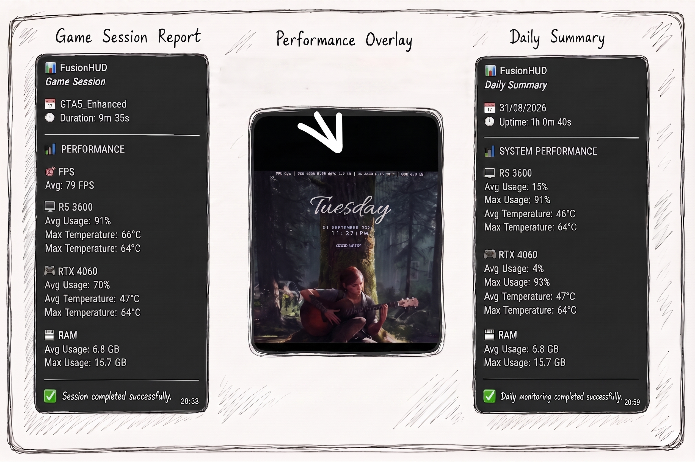
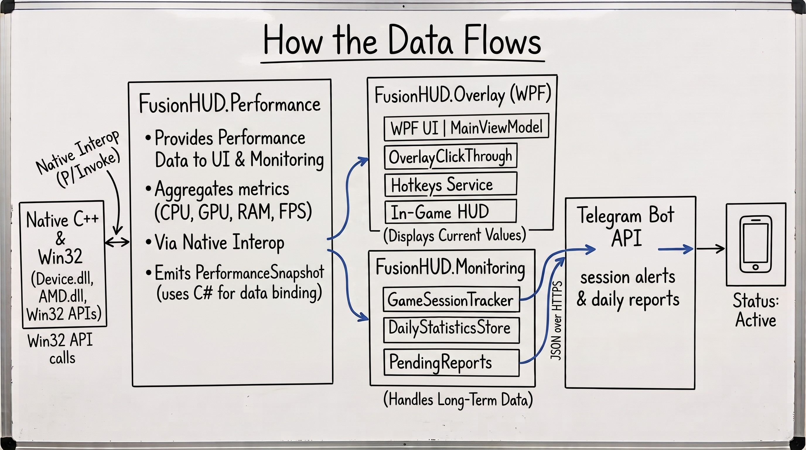

# FusionHUD

A lightweight Windows performance overlay for real-time system and game monitoring.

https://github.com/user-attachments/assets/197d55f6-fae8-432e-a2be-f7f13f4f2260

## Overview

FusionHUD is a Windows performance monitoring application designed to keep essential system and game performance information visible while an application is running.

The overlay provides real-time information such as FPS, CPU and GPU usage, temperatures, and RAM usage without requiring the user to leave the running application to inspect it.

Beyond real-time monitoring, FusionHUD includes a background monitoring system that collects performance data over time and generates daily and game-session statistics.

## Why FusionHUD?

The idea behind FusionHUD started with a simple need: I wanted a performance overlay that was focused specifically on the information I cared about.

Existing tools such as NVIDIA's performance overlay and MSI Afterburner already provide powerful monitoring capabilities. However, in my own experience, I wanted something different.

I wanted to see more of the performance information that mattered to me in one place, while keeping the overlay smaller, cleaner, and more focused.

I also wanted a simpler setup and experience than a full-featured tool such as MSI Afterburner, which provides a much broader set of monitoring and GPU tuning capabilities.

This led me to build FusionHUD around a more focused idea:

- Show the performance metrics I actually need.
- Keep the overlay compact and visually clean.
- Avoid unnecessary controls and configuration.
- Keep the application lightweight and straightforward to use.
- Have full control over how performance data is collected, processed, and displayed.

The project then evolved beyond a simple overlay. I extended it with background monitoring, game-session tracking, daily statistics, and Telegram reporting, turning it into a small end-to-end performance monitoring system rather than only an on-screen FPS counter.

FusionHUD is not intended to replace established tools. It is a personal implementation built around a specific workflow and a set of requirements that I wanted to explore and have full control over.

## Features

### Real-Time Performance Overlay

The overlay provides live information about:

- FPS
- CPU usage
- CPU temperature
- GPU usage
- GPU temperature
- RAM usage

It is designed to remain visible above other applications while staying compact and non-intrusive.

### Background Monitoring

FusionHUD continuously collects performance samples while the application is running.

These samples are used to calculate and track performance statistics over time rather than relying only on the current values displayed by the overlay.

### Game Session Tracking

FusionHUD can identify game sessions based on the availability of valid FPS data.

A session begins when valid game performance data is detected and ends when that data is no longer available.

This allows performance information to be associated with individual gaming sessions instead of being treated as one continuous stream of system data.

### Daily Reports

Collected performance data can be summarized into daily statistics.

FusionHUD can generate a summarized performance report and send it through Telegram, providing a simple way to review system activity without opening the application.

## How the Data Flows

FusionHUD separates data collection, performance processing, presentation, and monitoring into dedicated components.

At a high level, the data flows through the system like this:

**System & Game → Data Providers → Performance Data → Overlay**

At the same time, the same performance data can be consumed by the monitoring system:

**Performance Data → Monitoring → Statistics → Reports → Telegram**

This allows the overlay to focus on displaying current values while the monitoring system handles longer-term data collection, statistics, and reporting.

## Architecture

FusionHUD is organized into focused components, with each part responsible for a specific area of the application:

- **FusionHUD.App** — Application entry point and startup orchestration.
- **FusionHUD.Overlay** — Presentation layer and on-screen HUD window.
- **FusionHUD.Performance** — Performance data collection, hardware polling, FPS acquisition, and native integrations.
- **FusionHUD.Monitoring** — Background monitoring, game-session tracking, statistics, and automated Telegram reporting.

The architecture keeps the presentation layer, performance data, monitoring logic, and platform-specific integrations separated from each other.

This separation makes the project easier to maintain and extend without requiring changes across unrelated parts of the system.

## Designed to Grow

The current implementation focuses on the core metrics needed for a practical performance overlay, but the architecture is designed to support additional performance data in the future.

Potential extensions include:

- 1% Low FPS
- 0.1% Low FPS
- Frame time
- VRAM usage
- Disk activity
- Network statistics
- Additional CPU and GPU metrics
- More detailed game-session statistics

These are potential extensions rather than features currently included in version 1.0.0.

## Technology

- C#
- .NET 10
- WPF
- C++
- DirectX / DXGI
- RivaTuner Statistics Server (RTSS)
- Dependency Injection

C# and WPF are used for the main application, overlay, and monitoring architecture, while C++ is used where native-level hardware and graphics integration is required.

RivaTuner Statistics Server is used as part of the FPS acquisition pipeline.

## Project Status

**Version 1.0.0**

FusionHUD is a personal engineering and portfolio project, not a commercial or production-ready monitoring product.

Version 1.0.0 represents the current implemented feature set and serves as a foundation for further development and experimentation.

The project is intentionally structured so additional monitoring capabilities and performance metrics can be introduced without redesigning the entire application.

## License

See the [LICENSE](LICENSE) file for license information.
